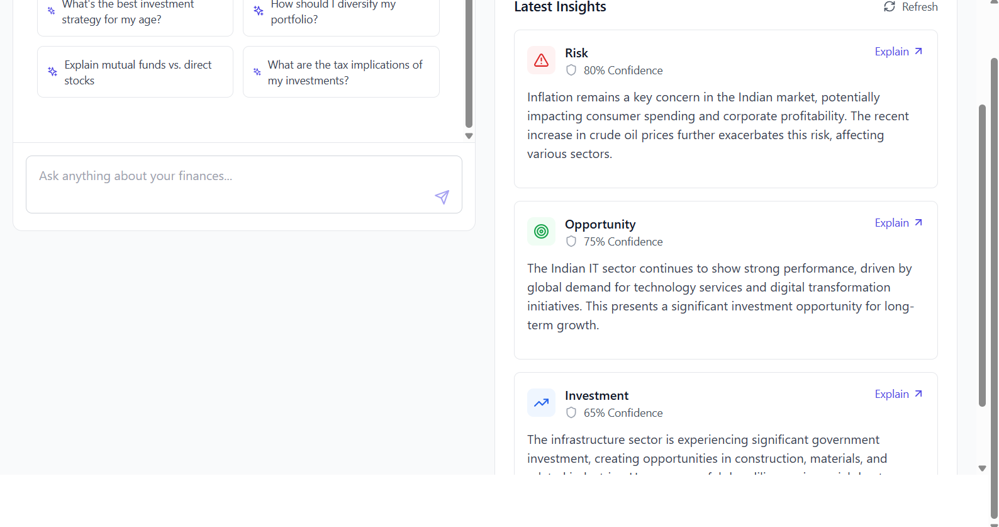

# Finance AI 🤖💰

Welcome to **Finance AI**, your all-in-one solution for intelligent financial management. Built for the Bolt Hackathon, this application leverages AI to provide deep insights, automate trading, and offer a seamless banking experience.



## 🌟 Features

- **🧠 AI-Powered Insights**: Get smart financial advice and predictions from our integrated AI assistant.
- **📈 Automated Trading**: Set up and automate your trading strategies based on market data and risk analysis.
- **📊 Interactive Dashboard**: A comprehensive overview of your finances, including cash flow, portfolio distribution, and summary metrics.
- **🎯 Financial Goals**: Set, track, and manage your financial goals with personalized recommendations.
- **🛡️ Loan Risk Assessment**: Advanced algorithms to assess loan risks for both lenders and borrowers.
- **🔒 Top-Notch Security**: Built with security in mind, featuring secure authentication and data handling.
- **💸 Seamless Transactions**: Easily send and request money, manage cards, and view statements.
- **⚙️ Customizable Settings**: Tailor the app to your needs with customizable notifications and account settings.

## 🛠️ Tech Stack

- **Frontend**: [React](https://react.dev/), [TypeScript](https://www.typescriptlang.org/), [Vite](https://vitejs.dev/), [Tailwind CSS](https://tailwindcss.com/)
- **Backend & Database**: [Supabase](https://supabase.io/)
- **AI & Machine Learning**: [TensorFlow.js](https://www.tensorflow.org/js), [Google Generative AI](https://ai.google.dev/)
- **Charting**: [Recharts](https://recharts.org/)
- **UI Components**: [shadcn/ui](https://ui.shadcn.com/) (based on `radix-ui`)

## 🚀 Getting Started

To get a local copy up and running, follow these simple steps.

### Prerequisites

- [Node.js](https://nodejs.org/en/) (v20.x or later)
- [npm](https://www.npmjs.com/)

### Installation

1.  Clone the repo
    ```sh
    git clone https://github.com/your_username/finance-ai.git
    ```
2.  Install NPM packages
    ```sh
    npm install
    ```
3.  Set up your Supabase environment. You'll need to create a `.env.local` file with your Supabase URL and anon key.
    ```
    VITE_SUPABASE_URL=YOUR_SUPABASE_URL
    VITE_SUPABASE_ANON_KEY=YOUR_SUPABASE_ANON_KEY
    ```
4.  Run the development server
    ```sh
    npm run dev
    ```

The application will be available at `http://localhost:5173`.

## 🤝 Contributing

Contributions are what make the open-source community such an amazing place to learn, inspire, and create. Any contributions you make are **greatly appreciated**.

If you have a suggestion that would make this better, please fork the repo and create a pull request. You can also simply open an issue with the tag "enhancement".

1.  Fork the Project
2.  Create your Feature Branch (`git checkout -b feature/AmazingFeature`)
3.  Commit your Changes (`git commit -m 'Add some AmazingFeature'`)
4.  Push to the Branch (`git push origin feature/AmazingFeature`)
5.  Open a Pull Request

## 📄 License

Distributed under the MIT License. See `LICENSE` for more information.


Built with ❤️ by B P MANISH 
